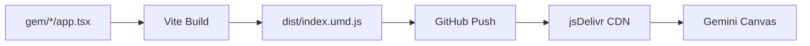

# CDNを用いてGemini Canvasから呼び出す方法

> **目的**: 生のTSXファイルをビルドし、CDN経由でGemini Canvasから動的に読み込む方法を解説する。

## 概要



## 1. ビルド設定 (vite.config.gem.ts)

### 必須設定

```typescript
import { defineConfig } from 'vite'
import react from '@vitejs/plugin-react'
import { resolve } from 'path'

const gemName = process.env.GEM_NAME!

export default defineConfig({
  plugins: [react({ jsxRuntime: 'classic' })],  // ← 重要: classic runtime
  
  define: {
    'process.env.NODE_ENV': JSON.stringify('production')  // ← 重要
  },
  
  build: {
    lib: {
      entry: resolve(__dirname, `../gem/${gemName}/app.tsx`),
      name: gemName,
      fileName: (format) => format === 'es' ? 'index.js' : `index.${format}.js`,
      formats: ['es', 'umd']
    },
    rollupOptions: {
      external: ['react', 'react-dom'],  // ← React のみ外部化
      output: {
        globals: {
          react: 'React',
          'react-dom': 'ReactDOM'
        }
      }
    }
  },
  
  resolve: {
    alias: {
      '@gem': resolve(__dirname, '../gem')
    }
  }
})
```

### 設定のポイント

| 設定 | 理由 |
|------|------|
| `jsxRuntime: 'classic'` | UMD環境で `jsx-runtime` バンドル問題を回避 |
| `process.env.NODE_ENV` 定義 | `process is not defined` エラーを防止 |
| `lucide-react` を external から除外 | グローバル変数が存在しないためバンドルに含める |

## 2. 遭遇したエラーと解決策

### エラー1: `process is not defined`

**原因**: UMDビルド内で `process.env.NODE_ENV` が未定義

**解決策**:
```typescript
define: {
  'process.env.NODE_ENV': JSON.stringify('production')
}
```

---

### エラー2: `Cannot read properties of undefined (reading 'Layout')`

**原因**: `lucide-react` を外部化したが、`window.Lucide` が存在しない

**誤った設定**:
```typescript
external: ['react', 'react-dom', 'lucide-react'],  // NG
globals: { 'lucide-react': 'Lucide' }  // NG
```

**正しい設定**:
```typescript
external: ['react', 'react-dom'],  // lucide-react を除外
// lucide-react はバンドルに含める
```

> [!CAUTION]
> `lucide-react` はCDN UMDビルドが公式に提供されていないため、外部化してはいけない。

---

### エラー3: 開発環境で画面が真っ白

**原因**: Vite開発サーバーは `window.React` / `window.ReactDOM` をグローバルに公開しない

**確認方法**: ブラウザコンソールで以下を確認
```javascript
console.log({ React: !!window.React, ReactDOM: !!window.ReactDOM });
// 開発環境: { React: false, ReactDOM: false }
```

**解決策**: 開発環境ではローカルインポートを使用

```typescript
// canvas.tsx (開発用)
import App from './app';  // ローカルインポート

// canvas.txt (CDN参照用コード)
const App = React.lazy(async () => {
  await import(cdnUrl);
  return { default: window.GemName };
});
```

---

### エラー4: jsDelivr キャッシュが更新されない

**原因**: jsDelivrはGitHubのコンテンツをキャッシュする

**解決策1**: キャッシュパージ
```
https://purge.jsdelivr.net/gh/{owner}/{repo}@{branch}/{path}
```

**解決策2**: バージョン指定
```typescript
const cdnUrl = `https://cdn.jsdelivr.net/.../index.umd.js?v=${Date.now()}`;
```

## 3. Gemini Canvas での使用方法

### HTML環境 (CDN直接読み込み)

```html
<!-- 1. 依存ライブラリ -->
<script crossorigin src="https://unpkg.com/react@18/umd/react.production.min.js"></script>
<script crossorigin src="https://unpkg.com/react-dom@18/umd/react-dom.production.min.js"></script>

<!-- 2. Gem本体 -->
<script src="https://cdn.jsdelivr.net/gh/{owner}/{repo}@main/gem/{GemName}/dist/index.umd.js"></script>

<!-- 3. レンダリング -->
<script>
  const App = window.GemName;
  ReactDOM.createRoot(document.getElementById('root')).render(
    React.createElement(App, { initialSteps: [] })
  );
</script>
```

### React環境 (Dynamic Import)

```typescript
const cdnUrl = 'https://cdn.jsdelivr.net/gh/{owner}/{repo}@main/gem/{GemName}/dist/index.umd.js';

const App = React.lazy(async () => {
  await import(/* @vite-ignore */ cdnUrl);
  return { default: window.GemName };
});

export default function Canvas() {
  return (
    <React.Suspense fallback={<div>Loading...</div>}>
      <App initialSteps={[]} />
    </React.Suspense>
  );
}
```

> [!IMPORTANT]
> Dynamic ImportでUMDを読み込む場合、ホスト環境で `window.React` と `window.ReactDOM` がグローバルに定義されている必要がある。

## 4. ビルドスクリプト

### build-gems.js

```javascript
import fs from 'fs';
import path from 'path';
import { execSync } from 'child_process';

const gemsDir = path.resolve(__dirname, '../../gem');

// Gem一覧を取得
const gems = fs.readdirSync(gemsDir).filter(gem => 
  fs.existsSync(path.join(gemsDir, gem, 'app.tsx'))
);

gems.forEach(gem => {
  console.log(`Building ${gem}...`);
  
  // Viteビルド実行
  execSync(`npx vite build -c vite.config.gem.ts`, {
    env: { ...process.env, GEM_NAME: gem },
    cwd: path.resolve(__dirname, '..')
  });
  
  // canvas.txt 生成 (CDN参照用)
  const canvasPath = path.join(gemsDir, gem, 'canvas.tsx');
  if (fs.existsSync(canvasPath)) {
    let content = fs.readFileSync(canvasPath, 'utf-8');
    const version = new Date().toISOString().split('T')[0].replace(/-/g, '');
    const cdnUrl = `https://cdn.jsdelivr.net/gh/{owner}/{repo}@main/gem/${gem}/dist/index.umd.js?v=${version}`;
    
    // ローカルインポートをCDNパターンに置換
    const replacement = `const App = React.lazy(async () => {
  await import("${cdnUrl}");
  return { default: window.${gem} };
});`;
    
    content = content.replace(/import App.* from ['"]\.\/app['"];?/, replacement);
    fs.writeFileSync(path.join(gemsDir, gem, 'dist', 'canvas.txt'), content);
  }
});
```

## 5. チェックリスト

新しいGemを作成する際のチェックリスト:

- [ ] `gem/{GemName}/app.tsx` を作成
- [ ] `export default` でメインコンポーネントをエクスポート
- [ ] `npm run build:gems` を実行
- [ ] `dist/index.umd.js` が生成されていることを確認
- [ ] ローカルで `grep "lucide-react" dist/index.umd.js` → ライセンスコメントのみ表示されること
- [ ] ローカルで `head -1 dist/index.umd.js` → `require("react")` のみ表示されること
- [ ] GitHubにプッシュ
- [ ] jsDelivrキャッシュをパージ (必要に応じて)
- [ ] CDN URLでアクセスして動作確認

## 6. トラブルシューティング

### ビルド成功後も動かない場合

```bash
# 1. ローカルビルドの確認
head -1 gem/{GemName}/dist/index.umd.js
# 期待出力: require("react") のみ

# 2. CDNの確認
curl -s "https://cdn.jsdelivr.net/gh/{owner}/{repo}@main/gem/{GemName}/dist/index.umd.js" | head -1
# ローカルと同じ出力であること

# 3. キャッシュパージ
curl "https://purge.jsdelivr.net/gh/{owner}/{repo}@main/gem/{GemName}/dist/index.umd.js"
```

### ブラウザコンソールで確認すべきこと

```javascript
// 1. グローバル変数の存在確認
console.log({ 
  React: !!window.React, 
  ReactDOM: !!window.ReactDOM 
});

// 2. Gemコンポーネントの確認
console.log(window.GemName);  // function または object が返ること
```
